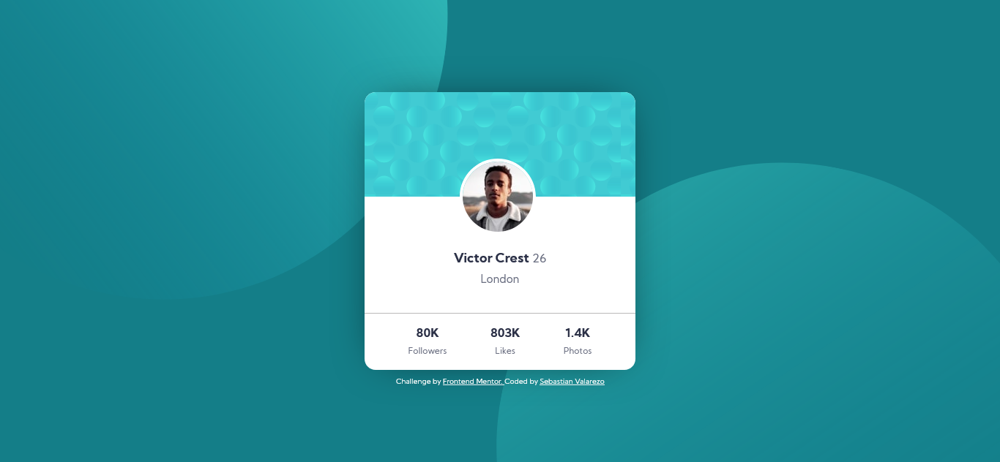
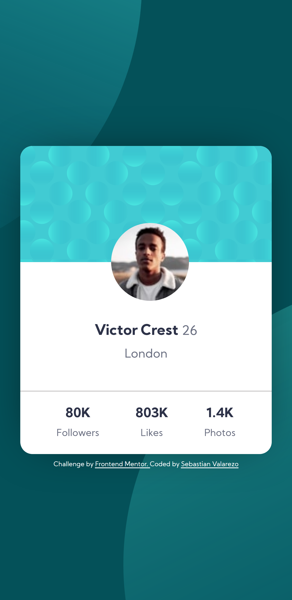

# Frontend Mentor - Profile card component solution

Ésta es una solución al [desafío del componente de la tarjeta de perfil en Frontend Mentor](https://www.frontendmentor.io/challenges/profile-card-component-cfArpWshJ). Los desafíos de Frontend Mentor lo ayudan a mejorar sus habilidades de codificación mediante la construcción de proyectos realistas.

## Tabla de Contenido

- [Visión General](#visión-general)
  - [El reto](#el-reto)
  - [Capturas de Pantalla](#capturas-de-pantalla)
  - [Enlaces](#enlaces)
- [Mi proceso](#mi-proceso)
  - [Construido con](#construido-con)
  - [¿Qué Aprendi?](#¿qué-aprendi?)
  - [Desarrollo Continuo](#desarrollo-continuo)
- [Autor](#autor)

## Visión General

### El reto

- Construya el proyecto con los diseños proporcionados

### Capturas de Pantalla

Desktop

Movil


### Enlaces

- Solución URL: [https://www.frontendmentor.io/solutions/profile-card-animation-flex-position-2F_HfSJCc](https://www.frontendmentor.io/solutions/profile-card-animation-flex-position-2F_HfSJCc)
- Web en Vivo URL: [https://profile-card-components.netlify.app/](https://profile-card-components.netlify.app/)

## Mi proceso

### Construido con

- Semantic HTML5 markup
- CSS custom properties
- Flexbox
- Animations

### ¿Qué aprendi?

Aprendi a utlizar más las posiciones relativas y absolutas y de que existen diversos caminos para llegar a un objetivo solo debemos analizar y escoger la meor desición. Tambien pude conocer de como aplicar animaciones a los elementos de html.

```html
<div class="page-animation"></div>
```

```css
.page-animation {
  animation-name: page-animation;
  animation-duration: 10s;
  animation-timing-function: ease-in-out;
  animation-iteration-count: infinite;
}
@keyframes page-animation {
  0% {
    background-color: var(--dark-cyan);
  }
  50% {
    background-color: var(--dark-cyan-two);
  }
  75% {
    background-color: var(--dark-cyan-three);
  }
  100% {
    background-color: var(--dark-cyan);
  }
}
```

### Desarrollo Continuo

Durante este proyecto pude ir conociendo más cosas sobre css, pero aun asi para futuros proyectos debo seguir llenando mi conocimiento sobre los uso de Flexbox, Grid CSS, Animation y de poder saber en que momentos utilizar cada una.

## Autor

- Frontend Mentor - [@SebastianValarezo](https://www.frontendmentor.io/profile/SebastianValarezo)
- Twitter - [@svalarezo2004](https://twitter.com/svalarezo2004)
